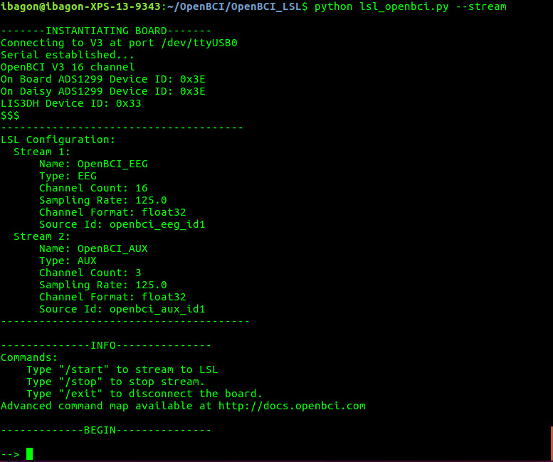
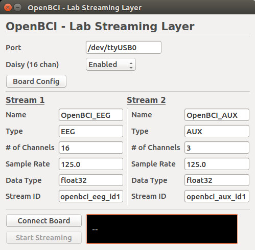

OpenBCI_LSL
==============

This tutorial contains information on how to stream [OpenBCI](http://openbci.com/) data through the [Lab Streaming Layer (LSL)](https://github.com/sccn/labstreaminglayer) network protocol.

Lab streaming layer is a networking system for real time streaming, recording, and analysis of time-series data. LSL can be used to connect OpenBCI to applications that can record, analyze, and manipulate the data, such as Matlab, NeuroPype, BCILAB, and others.

The [OpenBCI_LSL](link) repo contains a Python script that establishes an LSL stream of OpenBCI data, as well as the libraries and files needed to run LSL.

# SETUP

1. **Download or clone the [OpenBCI_LSL](link) repo from Github**

2. **Download and install [Python](https://www.python.org/downloads/) (either version 2 or 3).**

	Python might already be installed on your computer. Type `python --version` to check if you have Python version 2.7+ installed. 

3. **Install Python requirements**

	Navigate to the "OpenBCI_LSL" folder on your command line and terminal, and type:

	`pip install -r requirements.txt`

	Note: If you get the message "pip: command not found", you need to install pip: `sudo easy_install pip`. Then retry the command above.

# Usage

## Command Line Interface

#### Simple Stream

First, make sure your dongle is plugged in and board is powered on. Then go the the "OpenBCI_LSL" folder and type the following command:

`python openbci_lsl.py --stream`

After a few moments, you should see this output:

	

After board initialization, you are now ready to start streaming.

To begin streaming, type `/start`

To stop streaming, type `/stop`

To disconnect from the serial port, type `/exit` 

Remember to use `\exit` to disconnect the board as you end the program, to ensure that the serial port is safely closed.

#### Configuring the board from the command line interface

You also configure board settings from this interface. For full information regarding board settings and commands, see the [OpenBCI Firmware SDK](http://docs.openbci.com/software/01-OpenBCI_SDK)

To enter Channel Settings mode, you would need to enter an "x", followed by certain channel settings, followed by an "X". For example:

`--> x3020000X `

This command will do the following: ‘x’ enters Channel Settings mode. Channel 3 is set up to be powered up, with gain of 2, normal input, removed from BIAS generation, removed from SRB2, removed from SRB1. The final ‘X’ latches the settings to the ADS1299 channel settings register.

To view current board and register settings, enter: `--> ?`

If you get an error message at any point while using the command line interface, check the [Troubleshooting](#troubleshooting) section, or pull up an issue on the Github repository.

## GUI

If you would like the ability to configure the board and LSL stream with advanced settings, you can do so by running the GUI. The GUI comes up by default if you run the program with no flags:

`python openbci_lsl.py`

If you plug in your board and dongle before running the above command, the program should have already detected the appropriate settings for your board (port and daisy). If not, you can enter those yourself in the appropriate fields.

	

#### Streaming
To stream data, make sure the appropriate Port, Daisy, and LSL Stream fields are filled in correctly. Then, press "Connect" and then "Start Streaming". To pause streaming, click "Stop Streaming". To disconnect the board, press "Disconnect".

The board must be disconnected to change LSL settings. Once you "Connect" again, your current settings are saved until the next time you disconnect.

For consistent performance, pause streaming before you disconnect the board.

#### Configuring the board from the GUI
To change the channel settings, click on "Board Config". Note: this must be done BEFORE you press "Connect".

# Troubleshooting

Note: Many issues with board connectivity can simply be resolved by restarting the program and your board. Unplug your dongle, turn off the board, plug in the dongle, and turn on the board, in that order. This method works the most consistently.

TODO

